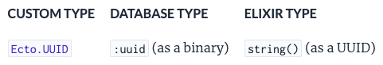

# 2024-02-22

> ![Important]
> imo: 使用 Prisma Migration 代替 Ecto Migration 对我来说很棒，因为我不关系如何编写 database migration，只需要关心如何使用 database client。
> 虽然可能造成依赖工具增多，😂
>
> 两种解决方式：
>
> 1. 学习 Ecto Migration，每次很烦。
> 2. 开发一个工具，实现类似 Prisma Migration 的功能，但是使用 Ecto。

1. Ecto.Schema 自带 id 字段，并且默认为整型，如果需要自定义 id 字段，需要在 schema 中使用 `@primary_key` 注解来指定。

```elixir
defmodule MyApp.User do
  use Ecto.Schema
  @primary_key {:uuid, :binary_id, autogenerate: true}
  schema "users" do
    field :name, :string
    field :email, :string
  end
end
```

- `:id`: integer
- `binary_id`: binary
- Ecto.UUID: uuid

Ecto 和其他语言不一样的地方： binary vs. string




ref: [Ecto.Schema](https://hexdocs.pm/ecto/Ecto.Schema.html#module-primary-key)

2. Prisma 默认不使用 database native uuid 类型，需要手动指定。

```prisma
model User {
  id String @id @default(dbgenerated("gen_random_uuid()")) @db.Uuid
}
```

BTW: 如果想使用其他 native database functions，可以通过 `extensions` 开启。

https://www.prisma.io/docs/orm/prisma-schema/data-model/unsupported-database-features
